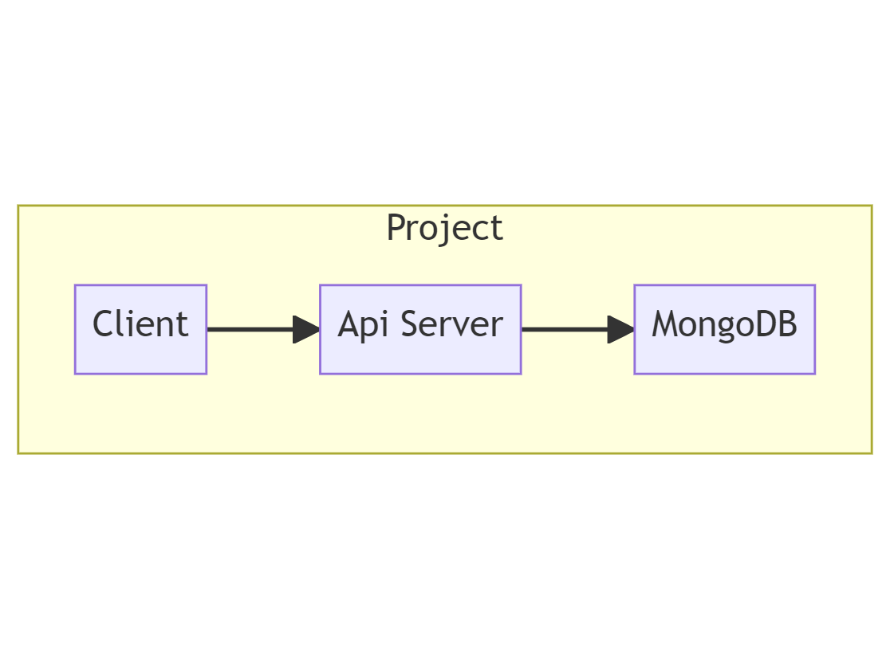

# Port Dashboard

Welcome to the Port Dashboard project! 
In order to run the project successfully, please follow the steps below.


# Architecture


## Prerequisites

Before you can run the Port Dashboard project, you need to ensure that you have MongoDB and Node JS installed locally on your machine.

### Installing MongoDB

If you haven't already installed MongoDB, you can download it from the official MongoDB website: [MongoDB Download](https://www.mongodb.com/try/download/community).

Follow the installation instructions provided for your specific operating system to get MongoDB up and running.

### Installing Node JS

If you haven't already installed Node JS, you can download it from the official Node website: [Node Download](https://nodejs.org/en/download/current).

Follow the installation instructions provided for your specific operating system to get Node up and running.

## Configuration

To configure the Port Dashboard project, you need to create a `.env` file in both the backend and client directories. Use the provided example below as a template for your `.env` files.

### Backend `.env` Configuration

In the `backend` directory, create a `.env` file with the following content:

```env
PORT=1234
DB_HOST=127.0.0.1
DB_PORT=27017
DB_NAME=port-challenge
```

Make sure to adjust the values as needed based on your local setup.
You have a `.example.env` in the backend folder for your convenient.

### Client `.env` Configuration

In the `client` directory, create a `.env` file with the following content:

```env
REACT_APP_BACKEND_URL=http://localhost:1234
```

This configuration sets the `REACT_APP_BACKEND_URL` to the backend API URL. Ensure that it matches the `PORT` you set in the backend `.env` file.
You have a `.example.env` in the client folder for your convenient.

## Running the Project

Once you have MongoDB installed and the `.env` files configured, you can run the Port Dashboard project by following these steps:

1. Open a terminal.
2. Navigate to the `backend` directory of the project.
3. Run the following command to install packages:

   ```bash
   npm install
   ```
4. Run the following command to start the backend server:

   ```bash
   npm start
   ```

5. Open another terminal.
6. Navigate to the `client` directory of the project.
7. Run the following command to install packages:

   ```bash
   npm install
   ```
8. Run the following command to start the frontend client:

   ```bash
   npm start
   ```

The Port Dashboard project should now be up and running, with both the backend server and the frontend client running concurrently. You can access the application by opening a web browser and navigating to `http://localhost:3000`.

Enjoy using the Port Dashboard! If you encounter any issues or have any questions, please refer to the project's documentation or seek assistance from the project maintainers.